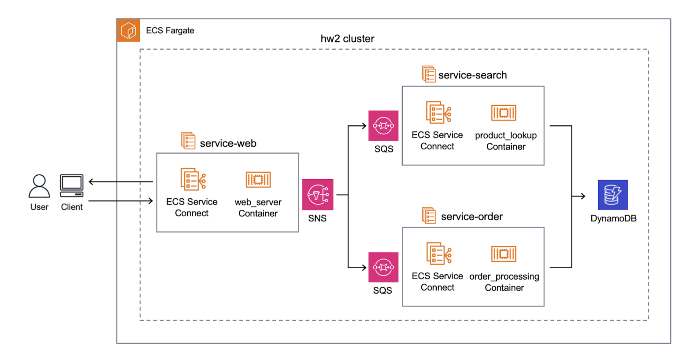
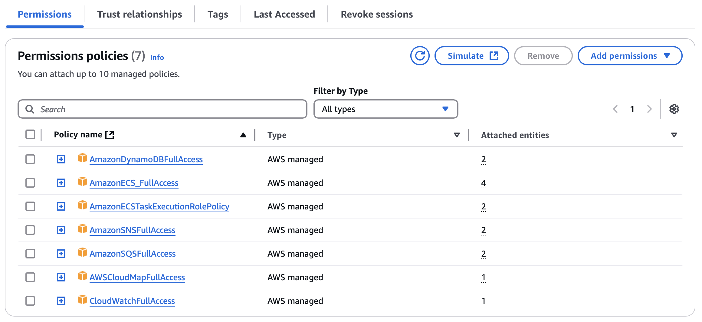

# E-commerce Platform with CI/CD (AWS CodePipline)

🙌 This guide will walk you through the steps required to set up and deploy your e-commerce platform with cloud-native architecture and microservices. 🙌

---

## 🧰 Prerequisites
- AWS account
- Docker installed locally
- AWS CLI configured (optional)

---

## 🍀 Overview

### 1. Introduction

The purpose of this project is to design and implement an e-commerce platform using AWS cloud services. The application allows users to search for products and make purchases. In Part 2, the architecture leverages AWS services like ECS, ECR, CodePipeline, and DynamoDB to ensure scalability, reliability, and performance.

### 2. Components
- **Service 1 (Product Lookup):** Handles product search requests by querying DynamoDB for product data.
- **Service 2 (Order Processing):** Processes customer orders by updating product inventory in DynamoDB.
- **Service 3 (Web Server):** Manages user interactions with the platform (UI/UX) and serves product pages.
> **Note:** All services use **ECS Service Connect** to implement service mesh for communication.
- **SNS (Simple Notification Service):** The Web Server publishes events (e.g., product search or order placement) to SNS.
- **SQS (Simple Queue Service):** Two queues are subscribed to SNS for processing messages:
  - **OrderQueue:** Consumed by the Order Processing service.
  - **LookupQueue:** Consumed by the Product Lookup service.
- **DynamoDB:** A NoSQL database where product details are stored and updated. Both the Product Lookup and Order Processing services interact with DynamoDB for retrieving and updating data. The primary key for DynamoDB is `productID`.

### 3. Architecutre Diagram

---

## 📖 Step-by-Step Configuration Guide

### ⚡️ 1. Set Up Amazon DynamoDB
1. Sign in to the **AWS Management Console**.
2. Navigate to **DynamoDB** and create a new table:
   - **Table Name:** `Products`
   - **Primary Key:** `productID` (Type: String)
3. Leave the default settings for capacity and click **Create Table**.
4. Note down the **Table ARN** for later use.

---

### ⚡️ 2. Set Up Amazon SNS (Simple Notification Service)
1. Go to **SNS** in the AWS Console.
2. Click **Create Topic**.
   - **Topic Type:** Standard
   - **Name:** `ecommerce-events`
3. Click **Create Topic** and note the **Topic ARN**.
4. Set up permissions for services that will publish to this SNS topic.

---

### ⚡️ 3. Set Up Amazon SQS (Simple Queue Service)
1. Navigate to **SQS**.
2. Click **Create Queue** twice to create two queues:
   - **Queue 1: OrderQueue**
     - **Queue Type:** Standard
   - **Queue 2: LookupQueue**
     - **Queue Type:** Standard
3. Subscribe both queues to the SNS topic:
   - Go back to **SNS** and open the topic `ecommerce-events`.
   - Click **Create Subscription** for each queue:
     - **Protocol:** SQS
     - **Endpoint:** Select the ARN of `OrderQueue` and `LookupQueue` respectively.
4. Confirm that both subscriptions are successfully created.

---

### ⚡️ 4. Set Up Amazon ECR (Elastic Container Registry)
1. Navigate to **ECR** and create repositories for each service:
    - `product-lookup`, `order-processing`, `web-server`
2. Open your terminal and navigate to the project directory where your Dockerfile is located. Use the following command to build your Docker image (e.g. order processing):
    - `docker buildx build --platform linux/amd64 -t hw2/project2-order`
3. Upload the Docker Image to Amazon ECR. Run the command to authenticate your Docker client with ECR.
    - `aws ecr get-login-password --region <your-region> | docker login --username AWS --password-stdin <your-account-id>.dkr.ecr.your-region.amazonaws.com`

3.	Tag Your Docker Image. Replace placeholders with your image and repository details.
    - `docker tag your-image-name:latest your-account-id.dkr.ecr.your-region.amazonaws.com/your-repository-name:latest`
    

4.	Push the Docker Image to ECR:
    - `docker push your-account-id.dkr.ecr.your-region.amazonaws.com/your-repository-name:latest`

---

### ⚡️ 5. Create an ECS Task Definition Using the ECR Image

1.	Go to the ECS section in the AWS Management Console.
2.	Click Task Definitions and then Create new Task Definition.
3.	Select Launch Type: Choose Fargate or EC2. 
4.	Task Role: Choose an existing IAM role or create a new one.
5. Add Container Definition with Health Check
    1.	Add Container:
	    - Container Name: Enter a name for your container (e.g., web-server).
	    - Image: Enter the ECR image URL (e.g., your-account-id.dkr.ecr.your-region.amazonaws.com/your-repository-name:latest).
	    - Memory Limits: Set the soft and hard memory limits as needed.
	    - Port Mappings: Configure the container ports (e.g., 80:80 for a web server).
	2.	Configure Health Check:
	    - Click Advanced container configuration.
	    - Under Health check, specify:
	    `Command: ["CMD-SHELL", "echo hello || exit 1"]`

	        > Note: this command will always succeed by echoing “hello”. If modified, || exit 1 ensures that if any command fails, the container will be marked as unhealthy.

	    - Interval: 30 (seconds between health checks)
	    - Timeout: 5 (seconds to wait for a health check to succeed)
	    - Retries: 3 (number of retries before marking the container as unhealthy)
	    - Start Period: 60 (seconds to wait before starting health checks)
	3.	Set Task Memory and CPU:
	    - Configure the required task-level memory and CPU resources.
	4.	Review and Create: Click Create to save your Task Definition.

---

### ⚡️ 5. Create an ECS Cluster
1. Go to **ECS** in the AWS Console.
2. Click **Create Cluster**.
3. Choose one of the following options based on your requirements:
   - **Networking only (for Fargate)**: Use this option if you want to deploy services using AWS Fargate, which manages the underlying infrastructure for you.
   - **EC2 Linux + Networking**: Use this option if you prefer to manage the EC2 instances yourself and have more control over the infrastructure.

        > Note: Use EC2 for more control and customization, and use Fargate for ease of use and a serverless experience

4. Name your cluster `hw2-cluster` and create it.

---

### ⚡️ 6. Set Up IAM Roles for ECS Services
1. Go to the **IAM** section in the AWS Console.
2. **Create a New Role**:
   - **Select**: AWS Service → ECS
   - **Use Case**: Choose ECS Task
3. **Attach Policies**:
   - **AmazonDynamoDBFullAccess**: To access and update DynamoDB.
   - **AmazonSQSFullAccess**: To interact with SQS.
   - **AmazonSNSFullAccess**: To publish messages to SNS.
   - Customize policies if needed to limit permissions based on your security requirements.
4. **Name the Role**: (e.g., `ecs-task-role`) and create it.
5. **Repeat** for any additional roles needed with different permissions.

---

### ⚡️ 7. Set Up ECS Services
For each service (`service-web`, `service-search`, `service-order`):

1. **Create a Task Definition**:
   - **Launch Type**: Fargate
   - **IAM Role**: Assign the `ecs-task-role` created earlier.
   - **Container Definitions**:
     - **Image URI**: Use the ECR image URL.
     - **Memory/CPU**: Configure based on requirements.
     - **Port Mappings**: Set up the required ports.
   - **Sidecar Container**: Add the `ecs-service-connect` container for mesh communication.
2. **Create a Service**:
   - **Cluster**: `hw2-cluster`
   - **Service Name**: (e.g., `service-web`)
   - **Number of Tasks**: 1 (adjust for scaling)
   - Enable **Service Connect** for each service to facilitate mesh communication.

---

### ⚡️ 8. Configure Service Mesh (ECS Service Connect)
1. Enable **Service Connect** in each ECS service.
2. Define service discovery settings and configure communication between services using mesh.

---

### ⚡️ 9. Set Up CI/CD with AWS CodePipeline
1. Navigate to **CodePipeline** and create a new pipeline.
2. **Source Stage**:
   - Select **GitHub** and connect to your repository.
3. **Build Stage**:
   - Use **AWS CodeBuild** to build and push Docker images.
   - Provide a `buildspec.yml` for build instructions.
4. **Deploy Stage**:
   - Select **ECS** and choose the appropriate cluster and services.

---

## 🔎 Monitoring and Troubleshooting (Optional)
- Use **CloudWatch** for monitoring and log aggregation.
- Verify service connections and communication in **ECS Service Connect**.
- Troubleshoot any namespace issues in **CloudMap** if service discovery is not working correctly.
